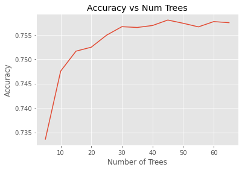
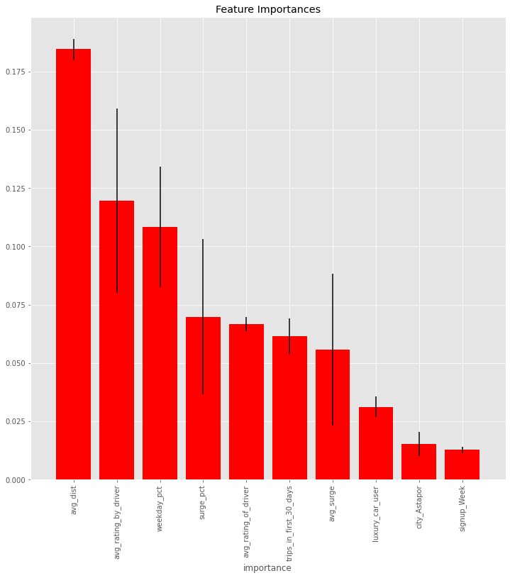
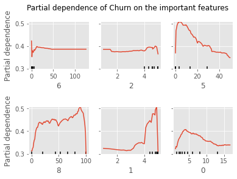

## Case Study

Today we are going to use all the skills we have learned to tackle a real
problem in industry. The problem is churn prediction with a ride-sharing
company in San Francisco.  Since the data is sourced from a real company, we
ask you not to share the dataset. See more about the problem in
[group.md](group.md). 

# Data Preprocessing
We took a simple approach to our preprocessing and feature engineering steps.  We've outlined them below as follows:  
- Converted `last_trip_date` and `signup_date` to DateTime objects
- Filled NaN values with the means for the following columns:  
  - `avg_rating_by_driver`
  - `avg_rating_of_driver`
- Filled NaN values in the `phone` column with "Unknown"
- Converted string variables into dummy variables for the `phone` and `city` columns

# Feature Engineering
To take seasonlity and time of week or month into account we converted our `last_trip_date` into a multitude of date features, using the fastai library method `add_datepart`:  

[Time feature](./img/date_time_columns.png)

# Random Forest Appraoch

Random forest was used to build a model to determine if someone was still active within the last 30 days or not. The number of features used was limited to 10, and trees to 45. 

Partial dependencies is where we can really see the information that might help the client. 

First plot: number of trips in first 30 days. Sharply increases dependence up to around 10 rides, so focusing on getting people those first 10 rides in the first month by offering incentives.

Third plot: percent of rides that are during surge pricing times. People are more likely to stay if they have a lower percent of surge prices. Cheaper prices, focusing on clients that use during off peak hours

4th: Weekday percent. Steady increase as weekday use increases, so people who are using this as a way to get to daily routine type instances are more likely to stay.

5th: Rating by driver. If the drivers liked them, they were more likely to stay, so positive interactions between drivers and passengers encouraged.

6th: Average distance driven. Increased until about 5 miles then decreases, so focusing on the routes around 5 miles. 

# XG Boost Gradient Boosting

  

Baseline model with almost zero feature engineering = 78.4%  
Meaning, we are very hopeful that if we can get our data engineering straightened out, that we can break into the 80% range for churn prediction. 

  

# Logisting Regression

A Logistics Regression of most features showed an Accuracy on train data of 71% and on test data of 70%

The biggest coefficients were whether the subject lived in King's Landing or used an iphone.

# Recommendations to the Client

The features that seem to matter most are.... 

